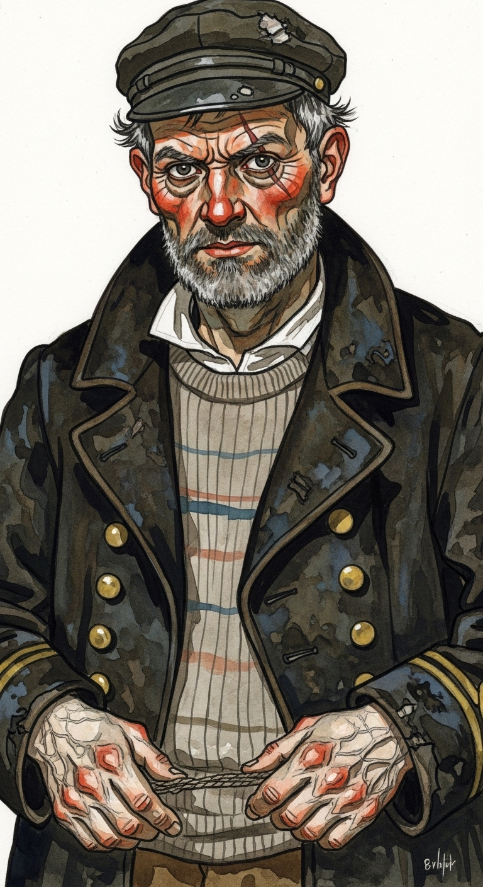

# Draculescu: The Cast of Characters

Every character in Draculescu is designed to be visually and psychologically distinctive, enabling unique musical themes and providing clear, consistent visual prompts for generative animation.

## Vlad Draculescu

TODO: The name "Vlad" feels a little trite/predictable. Maybe just "Count Draculescu" would suffice?

**Visual Description:** Vlad Draculescu is a figure of stark, unsettling presence. He is exceptionally gaunt and unnaturally tall, his body appearing almost skeletal, yet with an underlying, preternatural strength that belies his fragile appearance. His scalp is completely bald, smooth, and often appears to have a faint, almost transparent sheen. His skin is deathly pale, nearly translucent, revealing a delicate tracery of intricate blue veins, particularly prominent on his temples and the backs of his hands, giving his skin a waxy, preserved quality. His deep-set eyes are a piercing, almost black-brown, magnified slightly by the thick, tarnished brass-rimmed circular spectacles perched upon his tall, narrow nose. He moves with a deliberate, almost too-smooth grace.

**Attire:** He is consistently clad in a heavy, floor-length, collarless overcoat of dark, textured wool, so dark it appears almost black, with subtle, ancient-script-like stitching patterns visible along the cuffs and hem. Beneath this, he wears a high-necked shirt of unbleached, coarse linen, fastened with simple, unadorned bone buttons. His feet are encased in polished, heavy leather boots that make no sound as he moves. The overall impression is one of archaic austerity combined with an unsettling, almost inhuman cleanliness.

TODO: Let's give Draculescu two outfits. His "daytime" outfit should consist of a plague doctor's mask, an interesting wide-brimmed hat of some sort, an overcoat, gloves, and most importantly full-body covering (allowing the other characters to speculate that he cannot be exposed to the sun). His "indoor" outfit should be similarly grim, including a high collar vaguely reminiscent of a priest.

**Image Prompt:** `A gaunt, unnaturally tall man with an almost skeletal frame. Completely bald, smooth scalp with a faint sheen. Deathly pale, almost translucent skin with intricate blue veins prominent on temples and hands, appearing waxy. Deep-set, piercing black-brown eyes behind thick, tarnished brass-rimmed circular spectacles. Wears a floor-length, collarless overcoat of textured, almost black wool with subtle, ancient-script-like stitching patterns on cuffs and hem. High-necked unbleached linen shirt with bone buttons. Polished, heavy leather boots.`

**Personality & Motivations:** Draculescu is cold, intimidating, and ruthlessly methodical. He is devoid of superficial charm, operating purely on a detached, predatory logic that can often be mistaken for solemn benevolence. He views humanity primarily as a resource, but with a peculiar, ancient weariness, as if burdened by an eons-long duty. His actions are driven by a primal need for sustenance, yet cloaked in the guise of a detached healer, reflecting the narrative's moral ambiguity. He is a creature of deep, ancient truths confronting a modern, constructed reality.

TODO: Go slightly into more detail about his background as a healer, referencing old/eldritch traditions.

## Orthrus (Draculescu's Dog)

TODO: Let's name this dog after Argos (from the Odyssey) but tweak the name slightly to fit.

**Visual Description:** Orthrus is a creature of unsettling beauty and decrepitude. He is a gaunt, wiry greyhound, strikingly tall but alarmingly thin, with prominent ribs and hip bones pushing against his hide. His most distinguishing feature is the milky, clouded blue of his left eye, which seems to stare blankly into an unseen void, while his right eye socket is a puckered, dark, healed scar. His fur is a patchy, dull grey, often matted in places, giving him a scruffy, unkempt appearance. Numerous old scars crisscross his lean body, visible through his sparse fur. His tail is long and whip-like, occasionally thumping slowly against the ground.

**Image Prompt:** `A gaunt, wiry greyhound, tall and thin with prominent ribs and hip bones. Its left eye is milky, clouded blue and stares blankly. The right eye socket is a puckered, dark, healed scar. Patchy, dull grey fur, matted in places, revealing old scars. Appears ancient and decrepit.`

**Personality & Motivations:** Orthrus is fiercely, almost supernaturally, loyal to Vlad Draculescu. He possesses an unsettling, preternatural intelligence, communicating primarily through subtle growls, nudges, and an uncanny ability to anticipate Draculescu's needs. He is highly protective of his master and deeply distrustful of all strangers, often observing them with a chilling stillness. Orthrus embodies the untamed, ancient wildness that accompanies Draculescu, a silent, primal force that operates outside the bounds of human reason.

## Dr. Elias Thorne

**Visual Description:** Dr. Elias Thorne is a man whose physical presence seems to puff up with his own self-importance. He is of medium height but possesses a portly, well-fed build. His dark brown hair is meticulously parted and slicked back, thinning slightly at the crown, often appearing slightly greasy. His small, beady blue eyes dart constantly behind thick, wire-rimmed spectacles, conveying an almost frenetic analytical gaze. His complexion is rosy and well-maintained, always clean-shaven, exuding an air of self-satisfaction.

**Attire:** Dr. Thorne is impeccably dressed in a stiff, dark charcoal three-piece suit, custom-tailored to emphasize his broad chest. His white collar is starched to an unyielding crispness, and his conservative silk tie is knotted tightly and precisely. A heavy, ornate gold pocket watch chain dangles prominently from his waistcoat. His hands are plump, soft, and manicured, often gesturing with a dismissive authority.

**Image Prompt:** `A portly man of medium height with a rosy, well-fed, clean-shaven complexion. Meticulously parted, slicked-back dark brown hair, thinning at the crown. Small, beady blue eyes darting behind thick, wire-rimmed spectacles. Wears an impeccably tailored, stiff, dark charcoal three-piece suit, starched white collar, and tightly knotted conservative silk tie. A heavy, ornate gold pocket watch chain dangles from his waistcoat. Plump, manicured hands.`

**Personality & Motivations:** Dr. Thorne is the epitome of Victorian scientific hubris: arrogant, dogmatic, and utterly dismissive of anything that cannot be explained by his rigid understanding of empirical evidence and logic. His confidence borders on willful delusion, rendering him stubbornly blind to the supernatural truths encroaching upon his world. His primary motivation is to maintain the intellectual and social order he believes himself to be at the pinnacle of, and to impose his rational worldview upon any perceived chaos. He seeks to control and classify everything, including human suffering.

## Lady Eleanor Ashworth

**Visual Description:** Lady Eleanor Ashworth is a stark image of faded opulence. Once a woman of delicate elegance, her figure is now severely emaciated and frail, resembling a broken porcelain doll. Her long, fine auburn hair, once meticulously styled, is now matted, dull, and unkempt, fanned out haphazardly on her silk pillow. Her large, expressive hazel eyes, once sparkling with vivacity, are now deeply sunken and ringed with dark shadows, conveying a profound mix of fear, despair, and a fading will to live. Her skin is extremely pale, almost translucent, with a faint, unnatural, feverish flush across her cheeks.

**Attire:** She lies confined to a luxurious bed, draped in a fine, cream-colored lace nightgown that is now somewhat stained and disheveled from her illness. The bedsheets beneath her are of the finest, most expensive silk, a stark contrast to her deteriorating state. A delicate, antique gold locket, a family heirloom, rests around her neck, a symbol of her lost grandeur.

**Image Prompt:** `A frail, emaciated woman, once elegant, now resembling a broken porcelain doll. Long, matted, dull auburn hair fanned out on a silk pillow. Large, sunken, expressive hazel eyes ringed with dark shadows, conveying fear and despair. Extremely pale, almost translucent skin with a faint, feverish flush. Wears a stained, disheveled, cream-colored lace nightgown. A delicate, antique gold locket around her neck.`

**Personality & Motivations:** Lady Eleanor, accustomed to a life of absolute luxury and insulated from any form of hardship by her immense wealth, is now utterly consumed by terror and the rapid deterioration of her health. She clings desperately to any sliver of hope, even as death approaches. Her previous vanity and social status mean nothing in the face of the plague, highlighting her profound vulnerability to the unknown and the uncontrollable. Her quiet suffering is a profound commentary on the limits of material wealth.

## Lord Alistair Ashworth

**Visual Description:** Lord Alistair Ashworth is an imposing figure in his late 40s, with broad shoulders and a robust, though slightly overweight, build that still conveys authority. His thick, greying brown hair is neatly combed, and he sports a distinguished, well-groomed handlebar mustache. His stern, piercing blue eyes are often narrowed in a gaze of deep concern, suspicion, or annoyance. His complexion is ruddy, with the slight flush of a man who enjoys fine spirits and rich meals.

**Attire:** He is typically seen in a rich, dark velvet smoking jacket, worn over a crisp white shirt, with a subtly patterned ascot meticulously tied at his throat. His fingers are adorned with several heavy, ornate signet rings that gleam in the light. He is rarely without a polished briar pipe, which he often holds in his hand or tucks into a waistcoat pocket, using it as a prop for contemplation or to emphasize his irritation.

**Image Prompt:** `A broad-shouldered, robust man in his late 40s, slightly overweight but imposing. Thick, neatly combed greying brown hair and a distinguished handlebar mustache. Stern, piercing blue eyes often narrowed in concern or suspicion. Ruddy complexion. Wears a rich, dark velvet smoking jacket over a crisp white shirt, with a patterned ascot. Heavy, ornate gold signet rings on his fingers. Holds a polished briar pipe.`

**Personality & Motivations:** Lord Ashworth is the archetypal patriarch: protective of his family and reputation, but ultimately pragmatic and prone to panic when his ordered world is disrupted. He values social standing, control, and predictable comfort above all else. His initial motivation is to restore his life to its prior equilibrium, which quickly morphs into a vengeful pursuit when he blames others for his misfortunes. His fear makes him susceptible to manipulation and driven to desperate, often cruel, actions.

## Silas Blackwood (The Courier)

TODO: Let's name this character Finn and make him significantly younger, let's say nineteen. He does not need a surname; he can often be referred to diminutively as simply "the lad" by characters from The Island.

**Visual Description:** Silas Blackwood is a lean, wiry man in his early 30s, whose body appears perpetually tired and hunched, yet capable of deceptive bursts of strength. His sandy brown hair is perpetually disheveled, falling in unruly strands into his alert, nervous hazel eyes, which constantly scan his surroundings. His complexion is weathered and slightly tanned from constant travel, with a few faint scars on his chapped hands.

**Attire:** He wears a practical, worn leather riding coat, several sizes too big, cinched awkwardly at the waist with a heavy, unadorned belt. His roughspun trousers are tucked into sturdy, mud-splattered boots that have seen countless miles. A dark, wide-brimmed felt hat is almost permanently affixed to his head, casting his face in perpetual shadow and enhancing his air of guardedness. He always carries a large, battered leather satchel, stuffed with papers and small provisions.

**Image Prompt:** `A lean, wiry man in his early 30s, perpetually tired, with a slightly hunched posture. Disheveled sandy brown hair falling into his alert, nervous hazel eyes, which constantly scan. Weather-beaten, slightly tanned skin with faint scars on his hands. Wears a practical, worn leather riding coat, several sizes too big, cinched by a heavy belt. Roughspun trousers tucked into mud-splattered, sturdy boots. A dark, wide-brimmed felt hat casts his face in shadow. Carries a large, battered leather satchel.`

**Personality & Motivations:** Silas is fundamentally cowardly and easily frightened, seeing himself as merely a neutral messenger, a disposable cog in a much larger, more dangerous world. This self-perception allows him to rationalize his involvement in increasingly perilous affairs, as long as there's coin to be made. His primary motivations are simple survival and financial gain. However, when his detached role forces him directly into the heart of the conflict, his fear can become a catalyst for unexpected actions, exposing a deeper, more desperate side.

## Old Man Barnaby Thorne (The Lighthouse Keeper)

TODO: Thorne was already used as a surname; let's provide a new last name for Barnaby and his wife

**Visual Description:** Old Man Barnaby Thorne is a short, stout, barrel-chested man, his back permanently stooped from years of climbing the winding stairs of the lighthouse. His thinning, wispy white hair is often mussed by the relentless sea wind, giving him a wild, almost elemental look. His face is deeply weathered and leathery, covered in a network of sunspots and fine wrinkles, framed by a scruffy, greying beard. His small, watery grey eyes, though aged, are intensely observant, perpetually accustomed to scanning distant horizons.

**Attire:** He is dressed in a thick, salt-stained navy wool sweater, patched canvas trousers, and heavy, scuffed boots, all bearing the marks of a life spent battling the elements. He carries a rusted brass lantern, its glass often foggy with condensation, a constant companion and a symbol of his solitary vigil. He carries the faint, persistent scent of brine and lamp oil.

**Image Prompt:** `A short, stout, barrel-chested old man with a stoop, his thinning, wispy white hair mussed by the wind. Deeply weathered, leathery face covered in sunspots and wrinkles, with a greying beard. Small, watery, but intensely observant grey eyes. Wears a thick, salt-stained navy wool sweater, patched canvas trousers, and heavy, scuffed boots. Carries a rusted brass lantern. Smells faintly of brine and lamp oil.`

**Personality & Motivations:** Barnaby is a solitary and stoic figure, a creature of habit and meticulous observation. His isolated vantage point in the lighthouse allows him to see truths that others miss, making him a reluctant repository of secrets. Initially grounded in skepticism, his long life by the unpredictable sea has left him open to the subtle currents of superstition. His core motivations are to protect his ailing wife and to keep the lighthouse beacon burning, a symbolic stand of order and light against the encroaching darkness and unpredictability of the world. He possesses a quiet, understated bravery.

## Elara Thorne (The Lighthouse Keeper's Wife)

TODO: Let's name this character Edith after Egon Schiele's wife.

**Visual Description:** Elara Thorne is a delicate, almost ethereal presence, her small frame now tragically wasted by the plague, making her resemble a broken bird. Her long, dark brown hair, usually kept in a simple braid, is now tangled and dull with fever, often escaping its confines to frame her pale face. Her large, soft brown eyes, filled with a quiet desperation, convey a profound sense of fear and resignation. Her skin is pale and clammy, with patches of an unhealthy, feverish redness.

**Attire:** She is confined to her simple bed, clad in a plain, faded cotton shift. Threadbare blankets, humble and worn, are pulled up to her chin. Her hands, calloused and rough from years of domestic work, stand in stark contrast to the delicate, unmarred hands of Lady Ashworth, highlighting her lack of privilege. She wears a single, worn wooden bead necklace, her only personal adornment.

**Image Prompt:** `A small, delicate woman with a frame wasted by illness, resembling a broken bird. Long, tangled, dull dark brown hair, often escaping a simple braid. Large, soft, fearful brown eyes filled with quiet desperation. Pale, clammy skin with patches of unhealthy redness. Wears a simple, faded cotton shift with threadbare blankets. Calloused hands. A single, worn wooden bead necklace.`

**Personality & Motivations:** Elara is gentle, quietly dignified, and deeply resigned to her fate. Her suffering is largely internal, making her a poignant and sympathetic victim of both the plague and the ensuing supernatural events. Her primary motivation is a profound, unwavering love for her husband, for whom she tries to maintain a brave face even in her agony. Her quiet strength lies in her ability to endure, reflecting the stoicism of the common folk.

## Finn (The Vagrant)

TODO: I like the name Finn but felt like it fit the Courier better, so we'll want a new name here.

**Visual Description:** Finn is a man of medium height but appears significantly shorter due to his gaunt, hunched posture and a pronounced limp from an old industrial accident. He seems much older than his actual age, likely mid-30s. His coarse, greasy black hair falls in uneven, matted strands around his face. Only his right eye is visible, a piercing, desperate blue, filled with a complex mix of fear, cunning, and raw survival instinct. His left eye is covered by a grimy, frayed leather eyepatch, held precariously in place by a thin, knotted cord. His exposed skin is soot-stained and grimy, with deep lines etched by hardship, and the visible eye socket is often red-rimmed and irritated.

**Attire:** His clothes are a ragged, ill-fitting collection of scavenged fabrics in muted greys and browns, patched haphazardly together. He wears a tattered, sleeveless waistcoat over a torn, stained shirt. His boots are barely held together with string and worn-through soles. He constantly clutches a gnarled, rough-hewn walking stick, using it more for comfort and defense than support.

**Image Prompt:** `A gaunt, hunched man with a limp, appearing older than his mid-30s. Coarse, greasy black hair in messy strands. His right eye is a piercing, desperate blue. His left eye is covered by a grimy, frayed leather eyepatch. Soot-stained, grimy skin with deep lines, with a red-rimmed visible eye socket. Ragged, ill-fitting scavenged clothes of patched grey and brown fabrics, a tattered sleeveless waistcoat, torn shirt, and barely held-together boots. Clutches a gnarled walking stick.`

**Personality & Motivations:** Finn is a cynical survivor, shaped by a life of relentless hardship. He is cunning and distrustful, having learned to trust no one and to seize any advantage, no matter how small or morally ambiguous. His initial "enthralment" to Draculescu is not born of loyalty or affection, but rather a cold calculation for survival or a strange, perhaps misguided, recognition of a new form of power or stability. His motivations are driven purely by self-preservation and a yearning for relief from his suffering. His shifting allegiances and pragmatic opportunism make him a morally ambiguous and unpredictable character.

## Professor Adrian Van Helsing (The Vampire Hunter)

TODO: Let's rename this character something more original, "Van Helsing" skews a little too close to the source material.

**Visual Description:** Professor Adrian Van Helsing presents an imposing and formidable figure in his late 50s. He possesses a broad-shouldered, robust build that speaks of both physical strength and intellectual vigor. His thick, striking silver hair is meticulously groomed and swept back from his high, intelligent forehead. His intense, unblinking grey eyes are sharp with intellectual rigor and an unwavering, almost fanatical conviction. His complexion is healthy and slightly tanned, set in a stern, determined expression.

**Attire:** He is clad in a heavy, dark green tweed overcoat with broad, imposing lapels, perfectly tailored to his frame. Beneath, he wears a crisp, starched white shirt and a rich, crimson cravat, adding a touch of authoritative flair. His hands are encased in polished, dark leather gloves, suggesting readiness for action. He carries a sturdy, silver-topped cane, which subtly hints at a hidden mechanism, perhaps a concealed blade or tool. Various leather pouches and straps are subtly visible beneath his coat, hinting at a collection of specialized tools.

**Image Prompt:** `A broad-shouldered, robust, commanding man in his late 50s. Thick, meticulously groomed silver hair swept back from his high forehead. Intense, unblinking grey eyes, sharp with intellectual rigor and unwavering conviction. Healthy, slightly tanned complexion, stern, determined expression. Wears a heavy, dark green tweed overcoat with broad lapels, crisp white shirt, rich crimson cravat. Polished leather gloves. Carries a sturdy, silver-topped cane, with subtle hints of hidden tools and pouches.`

**Personality & Motivations:** Professor Van Helsing is dogmatic, unyielding, and absolutely convinced of his moral righteousness in a cosmic battle of good versus evil. He is driven by a deep-seated personal crusade against supernatural darkness, viewing himself as a divinely appointed protector of humanity. While highly intelligent and knowledgeable in arcane lore, he is also prone to confirmation bias, interpreting all evidence through the lens of his predefined beliefs. His ultimate motivation is the eradication of evil, no matter the personal cost, making him a relentless and formidable adversary.

## Captain Marius Ivanov (The Ship Captain)

**Visual Description:** Captain Marius Ivanov is a man of stocky, powerful build, his body thoroughly weathered by a lifetime at sea. In his early 40s, his short, salt-and-pepper hair is often damp with sea spray, matched by a thick, rugged beard. His dark eyes are shrewd, suspicious, and world-weary, constantly scanning his surroundings with a keen, pragmatic gaze. His skin is deeply tanned and wind-chapped, bearing the indelible marks of harsh elements, including a prominent scar arcing above his left eyebrow.

**Attire:** He wears a heavy, dark navy captain's coat, worn and faded from countless voyages, with tarnished brass buttons that have lost their original gleam. Beneath it, a simple, striped fisherman's sweater provides warmth. A battered captain's cap, its brim softened and reshaped by years of use, sits firmly on his head. His hands are thick and calloused, crisscrossed with old rope burns and testament to a life of manual labor on deck.

**Image Prompt:** `A stocky, powerful man in his early 40s, weathered by sea life. Short, salt-and-pepper hair and a thick beard. Shrewd, suspicious, world-weary dark eyes. Deeply tanned, wind-chapped skin with a prominent scar above his left eyebrow. Wears a heavy, dark navy captain's coat, worn and faded, with tarnished brass buttons. Simple striped fisherman's sweater. Battered captain's cap. Thick, calloused hands with old rope burns.`

**Personality & Motivations:** Captain Ivanov is a pragmatic and deeply superstitious man, whose life at sea has taught him to respect forces beyond human control. He prioritizes the safety of his ship and crew above all else. Initially dismissive of strange occurrences, he is easily unsettled by phenomena that defy his practical understanding. His primary motivations are survival and profit, but a deep-seated, if quiet, conscience often pricks him into action. He represents the common man caught uncomfortably between the mundane realities of his life and the encroaching supernatural horror.